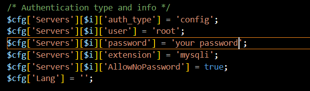

# bookEcho - Book Recommendation Website

This book recommendation website is designed to be a centralized hub for book enthusiasts to share and discover book recommendations. This book recommendation website was developed using HTML, CSS, Bootstrap v5.2.3, PHP, JavaScript, and MySQL for the database.

## Features
- **User Registration and Profiles:** Users can register and create individual profiles to personalize their experience.
- **Book Reviews and Ratings:** Users can share their thoughts on books they have read, rate them, and help others discover new books.
- **Manual Book Uploads:** If a book is not available in the database, registered users can manually upload information about the book.
- **Genre Categorization:** Books are categorized across various genres, allowing users to explore recommendations tailored to their specific interests and preferences.
- **Rankings and Comments:** Users can view rankings and comments from other participants to make informed decisions about their reading choices.

## Tech Stack

- Web server (e.g., Apache) 
- PHP
- MySQL

 ## Dependencies

- Bootstrap v5.2.3
- MySQL PHP driver

## Getting started

1. Copy the repository
   
    ``git clone https://github.com/AKaraeva/bookEcho.git``
2. Install Apache, MySQL and PHP using following link  https://www.apachefriends.org/de/index.html
3. Copy the project files to the web server directory.
4. Start Apache and MySQL on XAMPP
5. Open your web browser and navigate to http://localhost/phpmyadmin/ to access the phpMyAdmin interface.
6. Grant all privileges to the root user and change its password. 
7. Make sure yous saved the new password in \PathToYourXAMPP-Installation\phpMyAdmin\config.inc.php file
8. Create a new user granted with all privileges and save its credentials in bookEcho\sourceCode\config\dbaccess.php file

   

9. Create a new MySQL databse with name "bookecho"
10. Run the SQL script provided in the project to create tables. 
11. Test the application by accessing the URL in a web browser. Open a web browser and navigate to http://your-server-ip/bookecho/index.php

Happy testing! Enjoy exploring the features and functionality of the website. If you have any feedback or encounter any issues, feel free to reach out for assistance.

